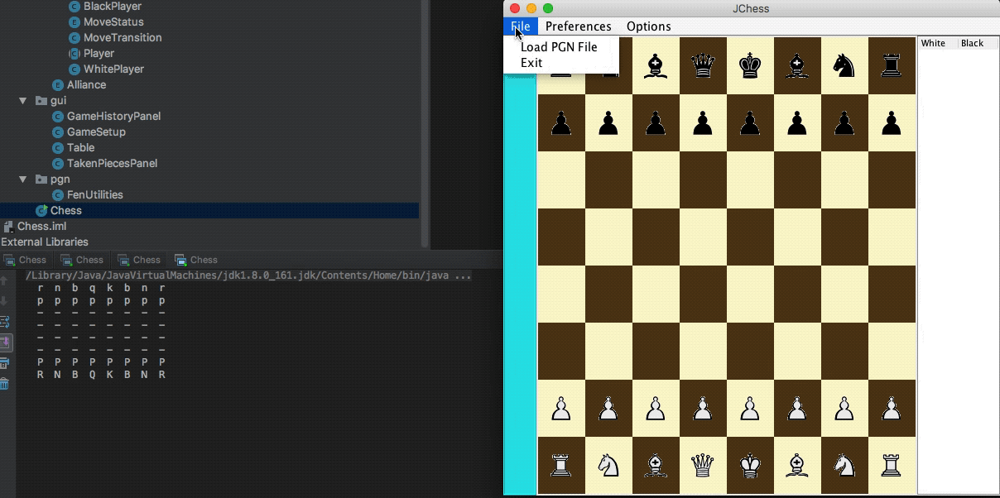

# Chess Player with AI Opponent

Implemented a Chess player in Java with a Java Swing UI and an AI opponent via the MinMax Algorithm (with the option of having the AI play against each other) following videos from:

[Java Chess Engine Tutorial](https://www.youtube.com/watch?v=h8fSdSUKttk&list=PLOJzCFLZdG4zk5d-1_ah2B4kqZSeIlWtt)

# To Run it: 

Clone the repo:
```
https://github.com/Tanraj/Chess.git
```
Run from `Chess.java`

```
src \ com \ chess \ Chess.java
```


